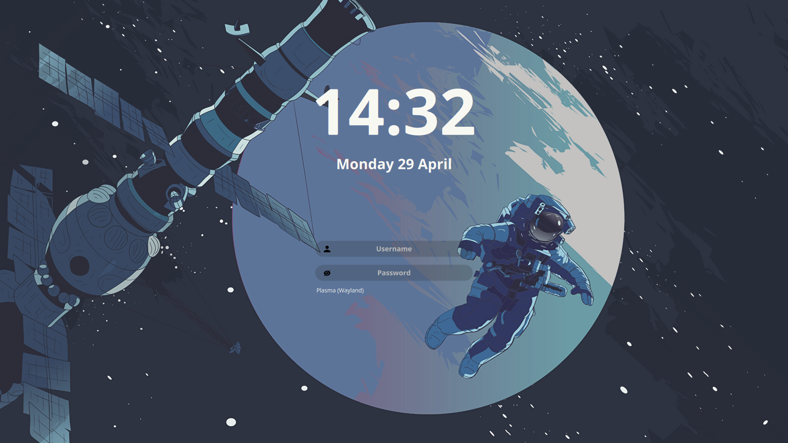

# LiberSDDM

This SDDM theme has a modern and elegant design that gives your login screen a stylish and attractive look.

## Installation

1. Clone the repository
    ```bash
    git clone https://github.com/CelestifyX/LiberSDDM.git
    ```

2. Navigate to the project directory:
    ```bash
    cd LiberSDDM
    ```

3. Make `install` file executable:
    ```bash
    chmod +x ./install
    ```

4. Run `./install` to install LiberSDDM:
    ```bash
    ./install
    ```

5. Select a theme in your DE settings, or install a theme with the command
6. Reboot the system to apply the settings

## Screenshots


